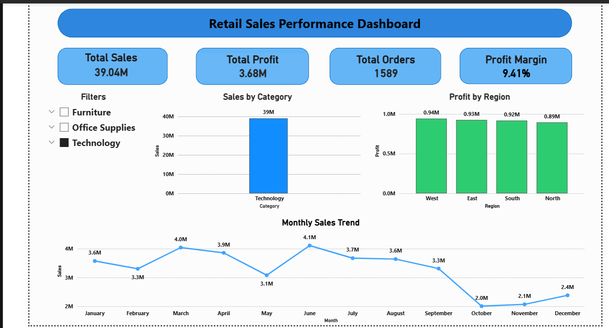
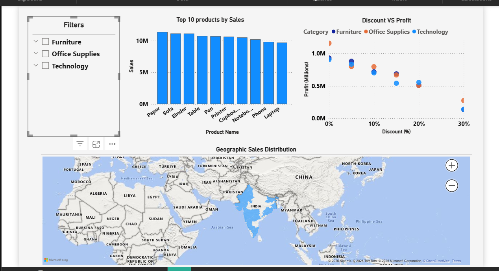

# Retail Sales Performance & Profitability Analysis

## Project Overview

This project analyzes retail sales data to evaluate sales performance, profitability, and product trends across different regions and customer segments.
The analysis helps identify key factors affecting revenue and profit, enabling better business decision-making.

---

## Project Objectives

* Analyze sales performance across product categories
* Identify the most profitable regions and products
* Understand the relationship between discounts and profit
* Identify loss-making products
* Analyze monthly sales trends

---

## Tools & Technologies Used

* Python
* Pandas
* NumPy
* Matplotlib
* Seaborn
* SQL
* Power BI
* Jupyter Notebook

---

## Project Files

Retail-Sales-Analysis
│
├── Retail_Sales_Analysis.ipynb → Python data analysis notebook
├── retail_sales_cleaned.xls → Dataset used for analysis
├── Retail_Sales_Dashboard.pbix → Power BI dashboard
├── dashboard.png → Screenshot of Power BI dashboard
└── README.md → Project documentation

---

## Data Analysis Process

1. Data Loading
2. Data Cleaning
3. Feature Engineering
4. Exploratory Data Analysis (EDA)
5. Data Visualization
6. Business Insights

---

## Key Analysis Performed

* Sales by Category
* Profit by Region
* Monthly Sales Trend
* Discount vs Profit Analysis
* Top Products by Sales
* Loss-Making Products
* Correlation Analysis

---

## Key Insights

* Certain product categories generate higher revenue and profit.
* Some regions contribute more to overall profitability.
* High discounts often reduce profit margins.
* A few products generate losses despite strong sales performance.

---

## Dashboard Preview
### Dashboard 1

### Dashboard 2

---

## Author
Pandurang Jogdand

Aspiring Data Analyst | Python | SQL | Power BI 
